```python
# Importing 
from IPython.core.display import display, HTML
display(HTML("<style>.container { width:100% !important; }</style>"))
%load_ext autoreload
%autoreload 2
import pandas as pd
import numpy as np
import os
import islets
import matplotlib.pyplot as plt
%config InlineBackend.figure_format = 'retina'
import islets._manuscript_functions as mf
import statsmodels.api as sm
```


<style>.container { width:100% !important; }</style>


```python
pathToFile = "/data/JanK/WD2019_20/glucose_7_pooling.csv"
print (open(pathToFile).read())
```

    glucose,legs,path,diet
    7,"{'1':(600,2500)}",/data/JanK/WD2019_20/Eva_Viljem_9.3.2020/2021_03_09_EPLi3.lif_analysis/Series003-4/2022_01_17_6.7_rois.pkl,WD
    7,"{'1':(600,2500)}",/data/JanK/WD2019_20/Jasmina_11.7.2019/Experiment.lif_analysis/Series016/2022_01_17_12.14_rois.pkl,CD
    7,"{'1':(600,2500)}",/data/JanK/WD2019_20/Jasmina_13.5.2020/Experiment__7glu.lif_analysis/Series006-11/2021_12_23_7.8_rois.pkl,WD_SP_NAD
    7,"{'1':(600,2500)}",/data/JanK/WD2019_20/Jasmina_19.2.2020/Experiment__2.lif_analysis/Series005-10/2021_12_23_9.10_rois.pkl,CD
    7,"{'1':(600,2500)}",/data/JanK/WD2019_20/Jasmina_23.7.2019/Exp_WD_5-1_inv.lif_analysis/Series022/2022_01_19_12.14_rois.pkl,WD
    7,"{'1':(600,2500)}",/data/JanK/WD2019_20/Jasmina_24.7.2019/Exp_WD_5-2_p.lif_analysis/Series016-17/2022_01_19_13.15_rois.pkl,WD
    7,"{'1':(600,2500)}",/data/JanK/WD2019_20/Jasmina_4.3.2020/Experiment__7 glu.lif_analysis/Series009-14/2022_01_14_11.13_rois.pkl,WD_NAD
    7,"{'1':(600,2500)}",/data/JanK/WD2019_20/Jure_13.2.2020/Experiment_006.lif_analysis/Series005-9/2021_12_21_12.14_rois.pkl,WD_SP
    7,"{'1':(600,2500)}",/data/JanK/WD2019_20/Jure_13.3.2020/Experiment4.lif_analysis/Series004-8/2021_12_21_12.14_rois.pkl,WD
    7,"{'1':(600,2500)}",/data/JanK/WD2019_20/Jure_3.3.2020/Experiment_5.lif_analysis/Series004-9/2021_12_21_12.14_rois.pkl,WD_NAD
    7,"{'1':(600,2500)}",/data/JanK/WD2019_20/Lidija_18.3.2020/20200318-WD-LKBi-1.lif_analysis/Series010-14/2022_01_12_9.10_rois.pkl,WD
    7,"{'1':(600,2500)}",/data/JanK/WD2019_20/Lidija_20.2.2020/20200220-WD-SP-NAD-LKBi-2.lif_analysis/Series005-9/2022_01_12_8.9_rois.pkl,WD_SP_NAD
    7,"{'1':(600,2500)}",/data/JanK/WD2019_20/Lidija_24.3.2020/20200324-WD-NK-LKBi-2.lif_analysis/Series009-14/2022_01_12_10.11_rois.pkl,WD_NK
    7,"{'1':(600,2500)}",/data/JanK/WD2019_20/Lidija_25.3.2020/20200325-WD-NK-LKBi-2.lif_analysis/Series006-10/2022_01_12_8.9_rois.pkl,WD_NK
    7,"{'1':(600,2500)}",/data/JanK/WD2019_20/Lidija_3.3.2020/20200303-WD-NAM-LKBi-2.lif_analysis/Series007-11/2022_01_12_9.10_rois.pkl,WD_NK
    7,"{'1':(600,2500)}",/data/JanK/WD2019_20/Marusa_11.2.2020/Experiment.lif_analysis/Series008-11/2022_02_12_7.8_rois.pkl,WD_SP
    7,"{'1':(600,2500)}",/data/JanK/WD2019_20/Marusa_2.3.2020/Experiment.lif_analysis/Series010-14/2021_12_27_12.14_rois.pkl,WD_NAD
    7,"{'1':(600,2500)}",/data/JanK/WD2019_20/Masa_15.7.2019/Exp.lif_analysis/Series014/2022_01_12_8.9_rois.pkl,WD_NAD
    7,"{'1':(600,2500)}",/data/JanK/WD2019_20/Masa_17.2.2020/Exp1.lif_analysis/Series003-7/2022_01_12_10.11_rois.pkl,WD_SP
    7,"{'1':(600,2500)}",/data/JanK/WD2019_20/Masa_19.2.2020/Exp_1.lif_analysis/Series004-8/2021_12_27_7.8_rois.pkl,CD
    7,"{'1':(600,2500)}",/data/JanK/WD2019_20/Masa_2.3.2020/Exp1.lif_analysis/Series008-13/2022_01_12_10.11_rois.pkl,WD_NAD
    7,"{'1':(600,2500)}",/data/JanK/WD2019_20/Masa_21.2.2020/Exp1.lif_analysis/Series007-11/2022_01_12_11.13_rois.pkl,WD_SP_NAD
    7,"{'1':(600,2500)}",/data/JanK/WD2019_20/Masa_23.3.2020/Exp1.lif_analysis/Series007-8/2022_01_12_4.5_rois.pkl,WD_NK
    7,"{'1':(600,2500)}",/data/JanK/WD2019_20/Masa_23.7.2019/Exp_WD_p.lif_analysis/Series020/2022_01_12_15.17_rois.pkl,WD
    7,"{'1':(600,2500)}",/data/JanK/WD2019_20/Masa_25.2.2020/Exp2.lif_analysis/Series006-11/2022_01_12_10.11_rois.pkl,WD_SP_NAD
    7,"{'1':(600,2500)}",/data/JanK/WD2019_20/Masa_25.2.2020/Exp7.lif_analysis/Series007-12/2022_01_12_11.13_rois.pkl,WD_SP_NAD
    7,"{'1':(600,2500)}",/data/JanK/WD2019_20/Masa_26.3.2020/Exp1.lif_analysis/Series003-4/2022_01_12_6.7_rois.pkl,WD_NK
    7,"{'1':(600,2500)}",/data/JanK/WD2019_20/Masa_4.7.2019/WD_NAM_SP.lif_analysis/Series022/2022_01_12_8.9_rois.pkl,WD_SP_NAD
    


```python
data = pd.read_csv(pathToFile)
data['legs'] = data['legs'].apply(eval)
# data = data[::10]
data
```


<div>
<style scoped>
    .dataframe tbody tr th:only-of-type {
        vertical-align: middle;
    }

    .dataframe tbody tr th {
        vertical-align: top;
    }

    .dataframe thead th {
        text-align: right;
    }
</style>
<table border="1" class="dataframe">
  <thead>
    <tr style="text-align: right;">
      <th></th>
      <th>glucose</th>
      <th>legs</th>
      <th>path</th>
      <th>diet</th>
    </tr>
  </thead>
  <tbody>
    <tr>
      <th>0</th>
      <td>7</td>
      <td>{'1': (600, 2500)}</td>
      <td>/data/JanK/WD2019_20/Eva_Viljem_9.3.2020/2021_...</td>
      <td>WD</td>
    </tr>
    <tr>
      <th>1</th>
      <td>7</td>
      <td>{'1': (600, 2500)}</td>
      <td>/data/JanK/WD2019_20/Jasmina_11.7.2019/Experim...</td>
      <td>CD</td>
    </tr>
    <tr>
      <th>2</th>
      <td>7</td>
      <td>{'1': (600, 2500)}</td>
      <td>/data/JanK/WD2019_20/Jasmina_13.5.2020/Experim...</td>
      <td>WD_SP_NAD</td>
    </tr>
    <tr>
      <th>3</th>
      <td>7</td>
      <td>{'1': (600, 2500)}</td>
      <td>/data/JanK/WD2019_20/Jasmina_19.2.2020/Experim...</td>
      <td>CD</td>
    </tr>
    <tr>
      <th>4</th>
      <td>7</td>
      <td>{'1': (600, 2500)}</td>
      <td>/data/JanK/WD2019_20/Jasmina_23.7.2019/Exp_WD_...</td>
      <td>WD</td>
    </tr>
    <tr>
      <th>5</th>
      <td>7</td>
      <td>{'1': (600, 2500)}</td>
      <td>/data/JanK/WD2019_20/Jasmina_24.7.2019/Exp_WD_...</td>
      <td>WD</td>
    </tr>
    <tr>
      <th>6</th>
      <td>7</td>
      <td>{'1': (600, 2500)}</td>
      <td>/data/JanK/WD2019_20/Jasmina_4.3.2020/Experime...</td>
      <td>WD_NAD</td>
    </tr>
    <tr>
      <th>7</th>
      <td>7</td>
      <td>{'1': (600, 2500)}</td>
      <td>/data/JanK/WD2019_20/Jure_13.2.2020/Experiment...</td>
      <td>WD_SP</td>
    </tr>
    <tr>
      <th>8</th>
      <td>7</td>
      <td>{'1': (600, 2500)}</td>
      <td>/data/JanK/WD2019_20/Jure_13.3.2020/Experiment...</td>
      <td>WD</td>
    </tr>
    <tr>
      <th>9</th>
      <td>7</td>
      <td>{'1': (600, 2500)}</td>
      <td>/data/JanK/WD2019_20/Jure_3.3.2020/Experiment_...</td>
      <td>WD_NAD</td>
    </tr>
    <tr>
      <th>10</th>
      <td>7</td>
      <td>{'1': (600, 2500)}</td>
      <td>/data/JanK/WD2019_20/Lidija_18.3.2020/20200318...</td>
      <td>WD</td>
    </tr>
    <tr>
      <th>11</th>
      <td>7</td>
      <td>{'1': (600, 2500)}</td>
      <td>/data/JanK/WD2019_20/Lidija_20.2.2020/20200220...</td>
      <td>WD_SP_NAD</td>
    </tr>
    <tr>
      <th>12</th>
      <td>7</td>
      <td>{'1': (600, 2500)}</td>
      <td>/data/JanK/WD2019_20/Lidija_24.3.2020/20200324...</td>
      <td>WD_NK</td>
    </tr>
    <tr>
      <th>13</th>
      <td>7</td>
      <td>{'1': (600, 2500)}</td>
      <td>/data/JanK/WD2019_20/Lidija_25.3.2020/20200325...</td>
      <td>WD_NK</td>
    </tr>
    <tr>
      <th>14</th>
      <td>7</td>
      <td>{'1': (600, 2500)}</td>
      <td>/data/JanK/WD2019_20/Lidija_3.3.2020/20200303-...</td>
      <td>WD_NK</td>
    </tr>
    <tr>
      <th>15</th>
      <td>7</td>
      <td>{'1': (600, 2500)}</td>
      <td>/data/JanK/WD2019_20/Marusa_11.2.2020/Experime...</td>
      <td>WD_SP</td>
    </tr>
    <tr>
      <th>16</th>
      <td>7</td>
      <td>{'1': (600, 2500)}</td>
      <td>/data/JanK/WD2019_20/Marusa_2.3.2020/Experimen...</td>
      <td>WD_NAD</td>
    </tr>
    <tr>
      <th>17</th>
      <td>7</td>
      <td>{'1': (600, 2500)}</td>
      <td>/data/JanK/WD2019_20/Masa_15.7.2019/Exp.lif_an...</td>
      <td>WD_NAD</td>
    </tr>
    <tr>
      <th>18</th>
      <td>7</td>
      <td>{'1': (600, 2500)}</td>
      <td>/data/JanK/WD2019_20/Masa_17.2.2020/Exp1.lif_a...</td>
      <td>WD_SP</td>
    </tr>
    <tr>
      <th>19</th>
      <td>7</td>
      <td>{'1': (600, 2500)}</td>
      <td>/data/JanK/WD2019_20/Masa_19.2.2020/Exp_1.lif_...</td>
      <td>CD</td>
    </tr>
    <tr>
      <th>20</th>
      <td>7</td>
      <td>{'1': (600, 2500)}</td>
      <td>/data/JanK/WD2019_20/Masa_2.3.2020/Exp1.lif_an...</td>
      <td>WD_NAD</td>
    </tr>
    <tr>
      <th>21</th>
      <td>7</td>
      <td>{'1': (600, 2500)}</td>
      <td>/data/JanK/WD2019_20/Masa_21.2.2020/Exp1.lif_a...</td>
      <td>WD_SP_NAD</td>
    </tr>
    <tr>
      <th>22</th>
      <td>7</td>
      <td>{'1': (600, 2500)}</td>
      <td>/data/JanK/WD2019_20/Masa_23.3.2020/Exp1.lif_a...</td>
      <td>WD_NK</td>
    </tr>
    <tr>
      <th>23</th>
      <td>7</td>
      <td>{'1': (600, 2500)}</td>
      <td>/data/JanK/WD2019_20/Masa_23.7.2019/Exp_WD_p.l...</td>
      <td>WD</td>
    </tr>
    <tr>
      <th>24</th>
      <td>7</td>
      <td>{'1': (600, 2500)}</td>
      <td>/data/JanK/WD2019_20/Masa_25.2.2020/Exp2.lif_a...</td>
      <td>WD_SP_NAD</td>
    </tr>
    <tr>
      <th>25</th>
      <td>7</td>
      <td>{'1': (600, 2500)}</td>
      <td>/data/JanK/WD2019_20/Masa_25.2.2020/Exp7.lif_a...</td>
      <td>WD_SP_NAD</td>
    </tr>
    <tr>
      <th>26</th>
      <td>7</td>
      <td>{'1': (600, 2500)}</td>
      <td>/data/JanK/WD2019_20/Masa_26.3.2020/Exp1.lif_a...</td>
      <td>WD_NK</td>
    </tr>
    <tr>
      <th>27</th>
      <td>7</td>
      <td>{'1': (600, 2500)}</td>
      <td>/data/JanK/WD2019_20/Masa_4.7.2019/WD_NAM_SP.l...</td>
      <td>WD_SP_NAD</td>
    </tr>
  </tbody>
</table>
</div>


```python
# variableof interest
voi = "diet"
```


```python
data = data.sort_values([voi])
```


```python
data[voi].unique()
```


    array(['CD', 'WD', 'WD_NAD', 'WD_NK', 'WD_SP', 'WD_SP_NAD'], dtype=object)


```python
# Here you specify the order in which they appear
varList = ['CD', 'WD', 'WD_NAD', 'WD_NK', 'WD_SP', 'WD_SP_NAD']
```


```python
varColorCode = dict(zip(varList, plt.cm.Dark2.colors))
# lets also plot them to see if python understands what we wrote and if we like them
_, ax = plt.subplots(1,1,figsize = (4,len(varColorCode)/3))
for il,var in enumerate(varColorCode):
    ax.axhline(il,color=varColorCode[var])
    ax.text(0,il,var+" ", va="center", ha="right", color=varColorCode[var])
mf.mystyle_axes(ax)
```


```python
nc = 8
nr = int(np.ceil(len(data)/nc))
fig, axs = plt.subplots(nr,nc,figsize=(3*nc,3*nr))
ia = 0
for i in data.index:
    path = data.loc[i,"path"]
    ## here we load the regions if we didn't ye
    if "regions" in data.columns and isinstance(data.loc[i,"regions"], islets.Regions):
        regions = data.loc[i,"regions"]
    else:
        regions = islets.load_regions(path)
        data.loc[i,"regions"] = [regions]
    ## here we plot the regions
    ax = axs.flat[ia]
    regions.plotEdges(ax=ax, scaleFontSize=8)
    ia += 1
    ax.set_xticks([])
    ax.set_yticks([])
    var = data.loc[i,voi]
    ax.text(0,-.01,f"{var}",size=8,va="top",transform=ax.transAxes, color=varColorCode[var])
    ax.text(1,-.01,f"exp: {i}",size=8,va="top",transform=ax.transAxes, color=varColorCode[var],ha="right")
    
# remove unused axes
for ax in axs.flat[ia:]:
    ax.remove()
```


```python
for i in data.index:
    # construct events_path from the roi path
    path = data.loc[i,"path"]
    events_path = path.replace("_rois.pkl","_auto_events.csv")
    # regions are in our table now
    regions = data.loc[i,"regions"]
    # reading events each time from the file is very fast
    Events = pd.read_csv(events_path, index_col=0)
    # plot events
    fig, axs = mf.plot_events(Events, regions)
    ax = axs[0]
    var = data.loc[i,voi]
    legs = data.loc[i,"legs"]
    ax.text(0,1.3,f"{voi}: {var}  exp: {i}",size=8,va="top",transform=ax.transAxes)
    for leg in legs:
        mf.emphasize_region(ax,legs[leg],ax.get_ylim(), color=varColorCode[var])
    ax.set_ylim(ax.get_ylim()[0]*.8,None)
```

    /home/srdjan/github/Physio_Ca/islets/_manuscript_functions.py:615: RuntimeWarning: More than 20 figures have been opened. Figures created through the pyplot interface (`matplotlib.pyplot.figure`) are retained until explicitly closed and may consume too much memory. (To control this warning, see the rcParam `figure.max_open_warning`).
      fig = plt.figure(figsize = (figwidth, figheight))


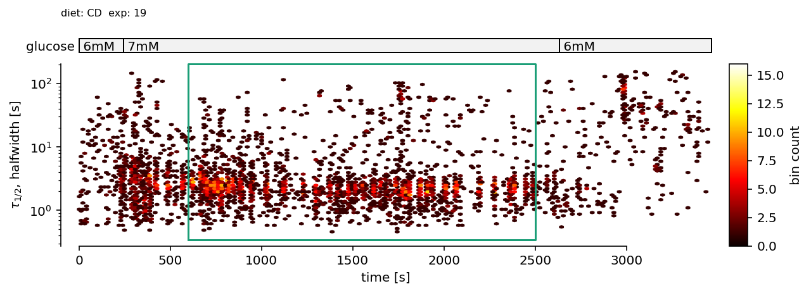


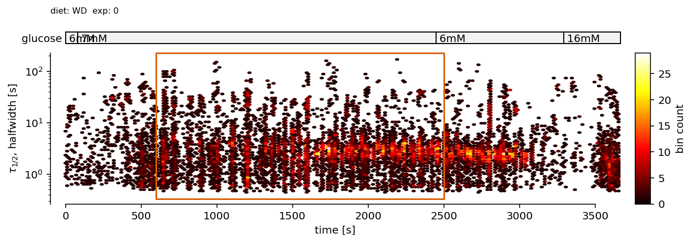


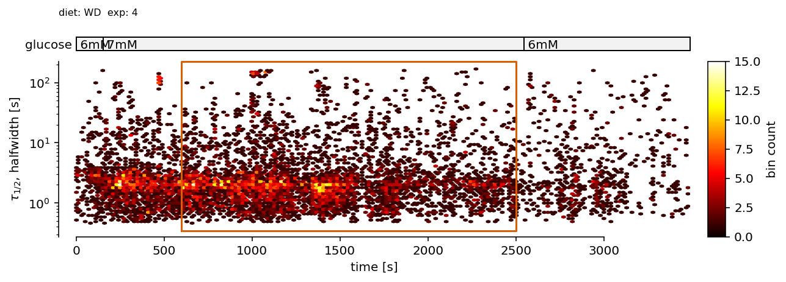


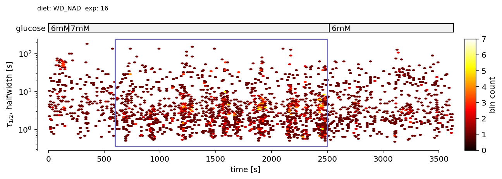


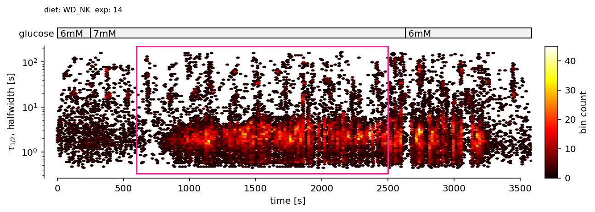


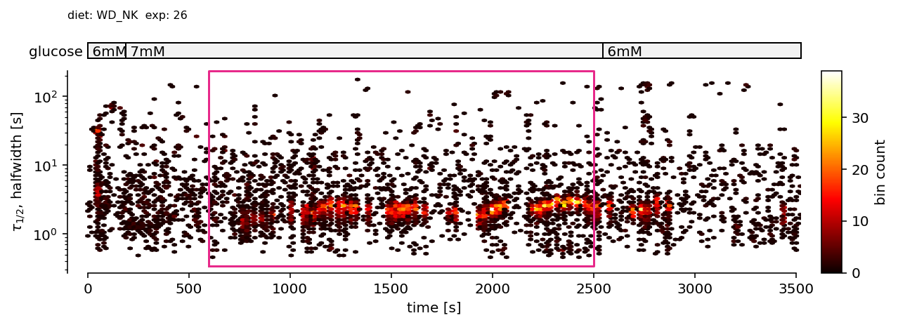


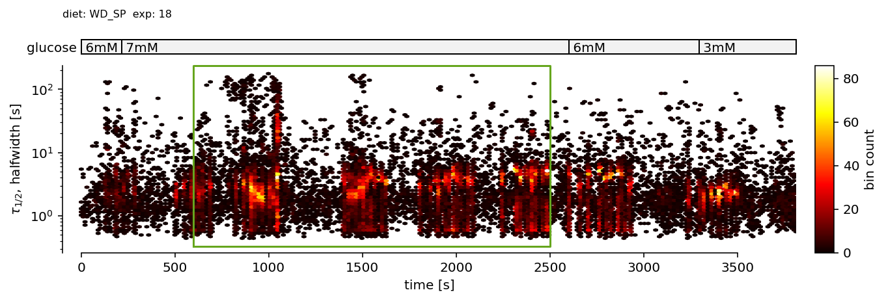


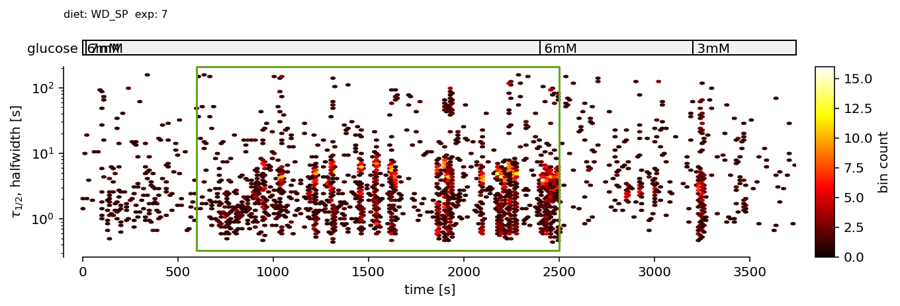


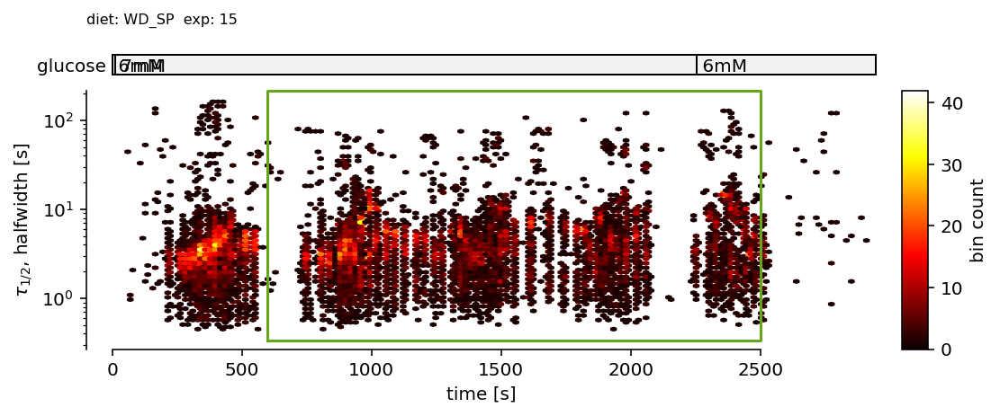


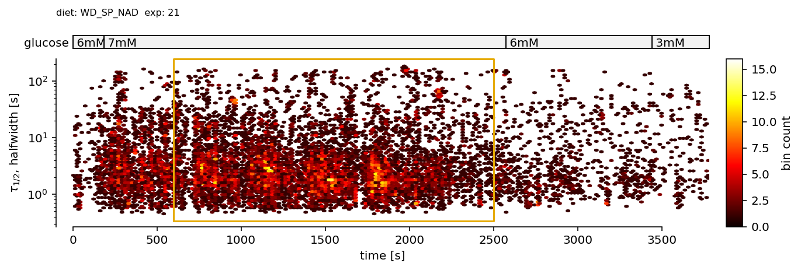


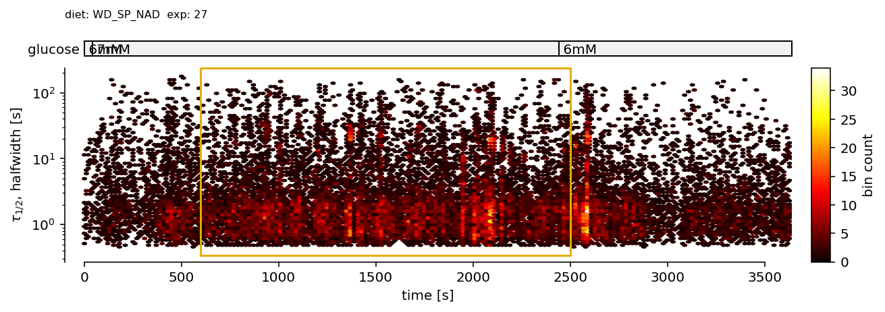


```python
hwBinEdges = np.geomspace(start = .1, stop = 1000, num = 100)
hwBinCenters = np.sqrt( hwBinEdges[1:] * hwBinEdges[:-1])
fig, axs = plt.subplots(1,2,figsize=(14,6))
axs[0].set_title("pdf")
axs[1].set_title("cdf")
for ax in axs:
    ax.set_xscale("log")
for i in data.index:
    # construct events_path from the roi path
    path = data.loc[i,"path"] 
    events_path = path.replace("_rois.pkl","_auto_events.csv")
    # reading events each time from the file is very fast
    Events = pd.read_csv(events_path, index_col=0)
    x = Events["halfwidth"].values.copy()
    h = np.histogram(x, hwBinEdges)[0]
    h = h/h.sum()
    axs[0].plot(hwBinCenters, h, label=f"exp: {i}")
    x.sort()
    axs[1].plot(x, np.linspace(0,1,len(x)), label=f"exp: {i}")
axs[0].set_ylim(0,)
axs[0].set_yticks([])
axs[0].set_ylabel("arbitrary units")
axs[1].set_ylim(0,1)
for ax in axs:
    ax.set_xlim(hwBinCenters[[0,-1]])
axs[1].legend(loc=4)
```


    <matplotlib.legend.Legend at 0x7f0ceb3ba7f0>


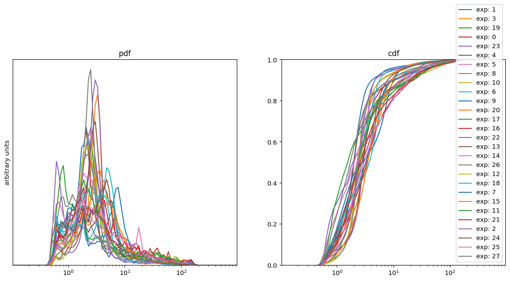


```python
hwRegions = {
#    "ultrashort": (0.2,1.5),
    "short": (0.5,20),
#    "long":  (30,200),
}
```


```python
# we again iterate over rows of data, this time collecting the important objects for each experiment:
allEpmpr = []
minEvents = 10
# ... 
for i in data.index:
    # ... import events, ...
    path = data.loc[i,"path"] 
    events_path = path.replace("_rois.pkl","_auto_events.csv")
    Events = pd.read_csv(events_path, index_col=0)
    # define legs
    islets.EventDistillery.define_legs(Events, data.loc[i,"legs"])
    # ... calculate events per min per active roi, ...
    evpmpar = mf.get_events_per_min_per_nrois(  # <-- see Step3 for an explanation what this does
        Events,
        hwRegions,
        minEvents=minEvents,
        reduceRois=2,
        Nbootstrap=30
    )
    # ... we label result with the experiment index
    expLabel = "exp"+str(i)
    evpmpar["experiment"] = expLabel
    evpmpar[voi] = data.loc[i,voi]
    ## and collect it into the big list
    allEpmpr += [evpmpar]
```

    There are 211 rois with more than 10 events (79%).
    Out of them, 105 are sampled 30 times to estimate mean and std of the firing rate.
    There are 316 rois with more than 10 events (84%).
    Out of them, 158 are sampled 30 times to estimate mean and std of the firing rate.
    There are 112 rois with more than 10 events (62%).
    Out of them, 56 are sampled 30 times to estimate mean and std of the firing rate.
    There are 142 rois with more than 10 events (78%).
    Out of them, 71 are sampled 30 times to estimate mean and std of the firing rate.
    There are 116 rois with more than 10 events (74%).
    Out of them, 58 are sampled 30 times to estimate mean and std of the firing rate.
    There are 104 rois with more than 10 events (68%).
    Out of them, 52 are sampled 30 times to estimate mean and std of the firing rate.
    There are 134 rois with more than 10 events (71%).
    Out of them, 67 are sampled 30 times to estimate mean and std of the firing rate.
    There are 197 rois with more than 10 events (74%).
    Out of them, 98 are sampled 30 times to estimate mean and std of the firing rate.
    There are 219 rois with more than 10 events (57%).
    Out of them, 109 are sampled 30 times to estimate mean and std of the firing rate.
    There are 274 rois with more than 10 events (73%).
    Out of them, 137 are sampled 30 times to estimate mean and std of the firing rate.
    There are 95 rois with more than 10 events (77%).
    Out of them, 47 are sampled 30 times to estimate mean and std of the firing rate.
    There are 224 rois with more than 10 events (63%).
    Out of them, 112 are sampled 30 times to estimate mean and std of the firing rate.
    There are 557 rois with more than 10 events (65%).
    Out of them, 278 are sampled 30 times to estimate mean and std of the firing rate.
    There are 41 rois with more than 10 events (51%).
    Out of them, 20 are sampled 30 times to estimate mean and std of the firing rate.
    There are 264 rois with more than 10 events (78%).
    Out of them, 132 are sampled 30 times to estimate mean and std of the firing rate.
    There are 268 rois with more than 10 events (71%).
    Out of them, 134 are sampled 30 times to estimate mean and std of the firing rate.
    There are 437 rois with more than 10 events (80%).
    Out of them, 218 are sampled 30 times to estimate mean and std of the firing rate.
    There are 160 rois with more than 10 events (77%).
    Out of them, 80 are sampled 30 times to estimate mean and std of the firing rate.
    There are 371 rois with more than 10 events (74%).
    Out of them, 185 are sampled 30 times to estimate mean and std of the firing rate.
    There are 465 rois with more than 10 events (72%).
    Out of them, 232 are sampled 30 times to estimate mean and std of the firing rate.
    There are 68 rois with more than 10 events (67%).
    Out of them, 34 are sampled 30 times to estimate mean and std of the firing rate.
    There are 230 rois with more than 10 events (76%).
    Out of them, 115 are sampled 30 times to estimate mean and std of the firing rate.
    There are 419 rois with more than 10 events (72%).
    Out of them, 209 are sampled 30 times to estimate mean and std of the firing rate.
    There are 166 rois with more than 10 events (59%).
    Out of them, 83 are sampled 30 times to estimate mean and std of the firing rate.
    There are 426 rois with more than 10 events (91%).
    Out of them, 213 are sampled 30 times to estimate mean and std of the firing rate.
    There are 236 rois with more than 10 events (70%).
    Out of them, 118 are sampled 30 times to estimate mean and std of the firing rate.
    There are 277 rois with more than 10 events (82%).
    Out of them, 138 are sampled 30 times to estimate mean and std of the firing rate.
    There are 308 rois with more than 10 events (63%).
    Out of them, 154 are sampled 30 times to estimate mean and std of the firing rate.


```python
allEpmpr = pd.concat(allEpmpr,ignore_index=True)
```


```python
allEpmpr.sort_values(["experiment","hw_region"])
```


<div>
<style scoped>
    .dataframe tbody tr th:only-of-type {
        vertical-align: middle;
    }

    .dataframe tbody tr th {
        vertical-align: top;
    }

    .dataframe thead th {
        text-align: right;
    }
</style>
<table border="1" class="dataframe">
  <thead>
    <tr style="text-align: right;">
      <th></th>
      <th>hw_region</th>
      <th>leg</th>
      <th>epmpr</th>
      <th>epmpr_std</th>
      <th>experiment</th>
      <th>diet</th>
    </tr>
  </thead>
  <tbody>
    <tr>
      <th>3</th>
      <td>short</td>
      <td>1</td>
      <td>2.183441</td>
      <td>0.121923</td>
      <td>exp0</td>
      <td>WD</td>
    </tr>
    <tr>
      <th>0</th>
      <td>short</td>
      <td>1</td>
      <td>2.769728</td>
      <td>0.131371</td>
      <td>exp1</td>
      <td>CD</td>
    </tr>
    <tr>
      <th>8</th>
      <td>short</td>
      <td>1</td>
      <td>1.007469</td>
      <td>0.068412</td>
      <td>exp10</td>
      <td>WD</td>
    </tr>
    <tr>
      <th>22</th>
      <td>short</td>
      <td>1</td>
      <td>1.031360</td>
      <td>0.039410</td>
      <td>exp11</td>
      <td>WD_SP_NAD</td>
    </tr>
    <tr>
      <th>18</th>
      <td>short</td>
      <td>1</td>
      <td>2.261124</td>
      <td>0.078406</td>
      <td>exp12</td>
      <td>WD_NK</td>
    </tr>
    <tr>
      <th>15</th>
      <td>short</td>
      <td>1</td>
      <td>0.932380</td>
      <td>0.049411</td>
      <td>exp13</td>
      <td>WD_NK</td>
    </tr>
    <tr>
      <th>16</th>
      <td>short</td>
      <td>1</td>
      <td>1.599560</td>
      <td>0.049222</td>
      <td>exp14</td>
      <td>WD_NK</td>
    </tr>
    <tr>
      <th>21</th>
      <td>short</td>
      <td>1</td>
      <td>1.463598</td>
      <td>0.054569</td>
      <td>exp15</td>
      <td>WD_SP</td>
    </tr>
    <tr>
      <th>13</th>
      <td>short</td>
      <td>1</td>
      <td>1.157083</td>
      <td>0.255185</td>
      <td>exp16</td>
      <td>WD_NAD</td>
    </tr>
    <tr>
      <th>12</th>
      <td>short</td>
      <td>1</td>
      <td>0.806953</td>
      <td>0.058495</td>
      <td>exp17</td>
      <td>WD_NAD</td>
    </tr>
    <tr>
      <th>19</th>
      <td>short</td>
      <td>1</td>
      <td>1.983506</td>
      <td>0.072261</td>
      <td>exp18</td>
      <td>WD_SP</td>
    </tr>
    <tr>
      <th>2</th>
      <td>short</td>
      <td>1</td>
      <td>0.754341</td>
      <td>0.070024</td>
      <td>exp19</td>
      <td>CD</td>
    </tr>
    <tr>
      <th>24</th>
      <td>short</td>
      <td>1</td>
      <td>2.069376</td>
      <td>0.061155</td>
      <td>exp2</td>
      <td>WD_SP_NAD</td>
    </tr>
    <tr>
      <th>11</th>
      <td>short</td>
      <td>1</td>
      <td>1.736427</td>
      <td>0.106592</td>
      <td>exp20</td>
      <td>WD_NAD</td>
    </tr>
    <tr>
      <th>23</th>
      <td>short</td>
      <td>1</td>
      <td>1.670774</td>
      <td>0.176902</td>
      <td>exp21</td>
      <td>WD_SP_NAD</td>
    </tr>
    <tr>
      <th>14</th>
      <td>short</td>
      <td>1</td>
      <td>1.867104</td>
      <td>0.073673</td>
      <td>exp22</td>
      <td>WD_NK</td>
    </tr>
    <tr>
      <th>4</th>
      <td>short</td>
      <td>1</td>
      <td>0.505223</td>
      <td>0.109561</td>
      <td>exp23</td>
      <td>WD</td>
    </tr>
    <tr>
      <th>25</th>
      <td>short</td>
      <td>1</td>
      <td>2.478758</td>
      <td>0.141420</td>
      <td>exp24</td>
      <td>WD_SP_NAD</td>
    </tr>
    <tr>
      <th>26</th>
      <td>short</td>
      <td>1</td>
      <td>0.767242</td>
      <td>0.061083</td>
      <td>exp25</td>
      <td>WD_SP_NAD</td>
    </tr>
    <tr>
      <th>17</th>
      <td>short</td>
      <td>1</td>
      <td>1.201216</td>
      <td>0.041427</td>
      <td>exp26</td>
      <td>WD_NK</td>
    </tr>
    <tr>
      <th>27</th>
      <td>short</td>
      <td>1</td>
      <td>1.623798</td>
      <td>0.130291</td>
      <td>exp27</td>
      <td>WD_SP_NAD</td>
    </tr>
    <tr>
      <th>1</th>
      <td>short</td>
      <td>1</td>
      <td>1.515720</td>
      <td>0.064466</td>
      <td>exp3</td>
      <td>CD</td>
    </tr>
    <tr>
      <th>5</th>
      <td>short</td>
      <td>1</td>
      <td>1.852117</td>
      <td>0.195546</td>
      <td>exp4</td>
      <td>WD</td>
    </tr>
    <tr>
      <th>6</th>
      <td>short</td>
      <td>1</td>
      <td>1.740971</td>
      <td>0.165740</td>
      <td>exp5</td>
      <td>WD</td>
    </tr>
    <tr>
      <th>9</th>
      <td>short</td>
      <td>1</td>
      <td>2.883680</td>
      <td>0.096944</td>
      <td>exp6</td>
      <td>WD_NAD</td>
    </tr>
    <tr>
      <th>20</th>
      <td>short</td>
      <td>1</td>
      <td>1.333852</td>
      <td>0.101872</td>
      <td>exp7</td>
      <td>WD_SP</td>
    </tr>
    <tr>
      <th>7</th>
      <td>short</td>
      <td>1</td>
      <td>0.772716</td>
      <td>0.073285</td>
      <td>exp8</td>
      <td>WD</td>
    </tr>
    <tr>
      <th>10</th>
      <td>short</td>
      <td>1</td>
      <td>2.403825</td>
      <td>0.218376</td>
      <td>exp9</td>
      <td>WD_NAD</td>
    </tr>
  </tbody>
</table>
</div>


```python
#### Details
mf.check_roi_heterogeneity(Events.query("halfwidth<20"),regions, boxplot_kwargs={"showfliers":False});
```


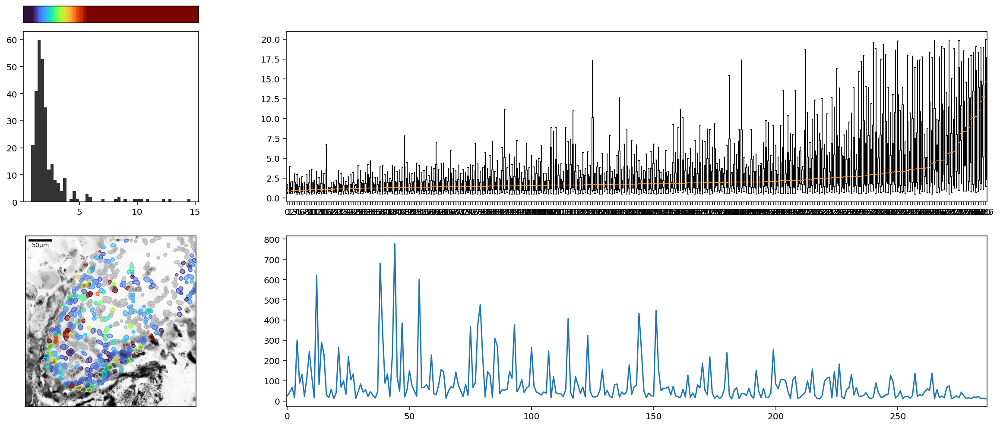


```python
exps = list(allEpmpr["experiment"].unique())
```


```python
jitter = .01 # how much you wish to stagger the points in the plot below
allEpmpr["plot_pos"] = allEpmpr[voi].apply(lambda xi: varList.index(xi)) + allEpmpr["experiment"].apply(lambda xi: exps.index(xi)-(len(exps)-1)/2)*jitter
```


```python
rescale = 100 # rescale to values you can change it if you wish
fig, axs = plt.subplots(1,len(hwRegions),figsize=(1+len(hwRegions)*len(varList)*.5,5))
plt.subplots_adjust(wspace=.5, top = .86, bottom = .3)

if rescale>1:
    fig.suptitle(f"events per minute per {rescale} active rois*")
else:
    fig.suptitle(f"events per minute per active roi*\n")
if len(hwRegions)==1:
    axs = [axs]
for ia,hwr in enumerate(hwRegions):
    ax = axs[ia]
    for exp,df in allEpmpr.query(f"hw_region=='{hwr}'").groupby("experiment"):
        ax.plot(df['plot_pos'],rescale*df['epmpr'], "grey")
    for var in varList:
        df = allEpmpr.query(f"hw_region=='{hwr}' and {voi}=='{var}'").copy()
        c = varColorCode[var]
        ax.errorbar(df['plot_pos'],
                    df["epmpr"]*rescale,
                    df["epmpr_std"]*rescale,
#                     color=c,
                    marker="o",ls="none", mec="k")
    ax.text(0,1.03,hwr, transform=ax.transAxes)
for ax in axs:
    ax.set_ylim(0,)
    ax.set_xlim(-.5,len(varList)+.5)
    ax.set_xticks(np.arange(len(varList)))
    ax.set_xticklabels([lbl.replace("_","+") for lbl in varList], rotation=45)
axs[0].text(1,1.03,r"$\tau_{1/2}<%g$"%hwRegions["short"][1],ha="right",transform=axs[0].transAxes)  
```


    Text(1, 1.03, '$\\tau_{1/2}<20$')


```python
from tqdm.notebook import tqdm
```


```python
# we again iterate over rows of data, this time collecting the important objects for each experiment:
allHWs = []
minEvents = 10

for i in tqdm(data.index):
    # ... import events, ...
    path = data.loc[i,"path"] 
    events_path = path.replace("_rois.pkl","_auto_events.csv")
    Events = pd.read_csv(events_path, index_col=0)
    # define legs
    legs = data.loc[i,"legs"]
    islets.EventDistillery.define_legs(Events, legs)
    Events = Events.dropna().copy()
    for hwr in hwRegions:
        hw0,hw1 = hwRegions[hwr]
        evs = Events.query(f"halfwidth<{hw1} and halfwidth>={hw0}")
        x = [dfr["halfwidth"].median() for roi,dfr in evs.groupby("roi") if len(dfr)>minEvents]
    
        tmp = {
            "experiment": "exp"+str(i),
            voi: data.loc[i,voi],
            "halfwidth": np.mean(x),
            "halfwidth sem": np.std(x)/np.sqrt(len(x)-1),
            "hw_region": hwr,
            }
    allHWs += [tmp]
```


      0%|          | 0/28 [00:00<?, ?it/s]


```python
allHWs = pd.DataFrame(allHWs)
```


```python
jitter = .01 # how much you wish to stagger the points in the plot below
allHWs["plot_pos"] = allHWs[voi].apply(lambda xi: varList.index(xi)) + allHWs["experiment"].apply(lambda xi: exps.index(xi)-(len(exps)-1)/2)*jitter
```


```python
fig, axs = plt.subplots(1,len(hwRegions),figsize=(1+len(hwRegions)*len(varList)*.5,5))
plt.subplots_adjust(wspace=.5, top = .86, bottom = .3)


fig.suptitle(f"median halfwidth of active rois*")

if len(hwRegions)==1:
    axs = [axs]
for ia,hwr in enumerate(hwRegions):
    ax = axs[ia]
    for exp,df in allHWs.query(f"hw_region=='{hwr}'").groupby("experiment"):
        ax.plot(df['plot_pos'],df['halfwidth'], "grey")
    for var in varList:
        df = allHWs.query(f"hw_region=='{hwr}' and {voi}=='{var}'").copy()
        c = varColorCode[var]
        ax.errorbar(df['plot_pos'],
                    df["halfwidth"],
                    df["halfwidth sem"],
                    marker="o",ls="none", mec="k")
    ax.text(0,1.03,hwr, transform=ax.transAxes)
for ax in axs:
#     ax.set_ylim(0,)
    ax.set_xlim(-.8,len(varList)-.2)
    ax.set_xticks(np.arange(len(varList)))
    ax.set_xticklabels([lbl.replace("_","+") for lbl in varList], rotation=45)
axs[0].text(1,1.03,r"$\tau_{1/2}<%g$"%hwRegions["short"][1],ha="right",transform=axs[0].transAxes)  
```


    Text(1, 1.03, '$\\tau_{1/2}<20$')


```python

```
